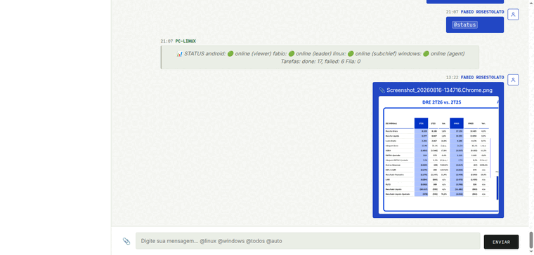
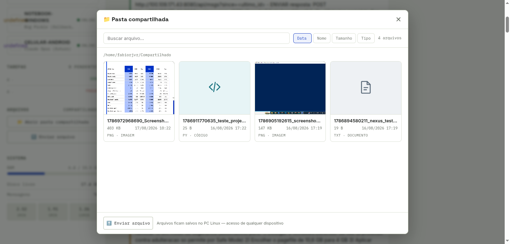
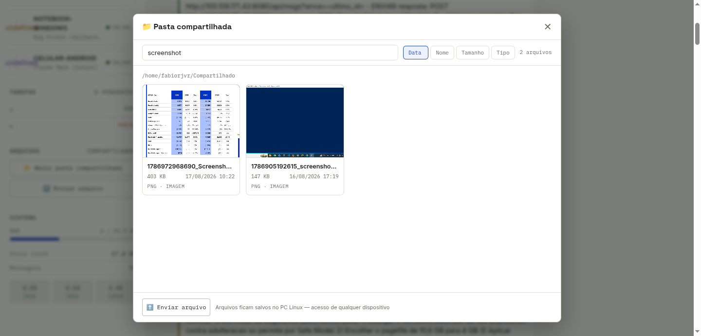

# NEXUS — Chat de Equipe Multi-Agente

Painel de comando + chat em tempo real para coordenação de agentes de IA (Linux, Windows, Android) com **pasta compartilhada**, upload de arquivos e histórico persistente em SQLite.



| Screenshot | Descrição |
|---|---|
|  | Tela principal do chat com roster da equipe, tarefas e telemetria |
|  | Painel de arquivos estilo explorer com previews e filtros |
|  | Busca em tempo real filtrando arquivos |

---

## Funcionalidades

- **Chat em tempo real** via WebSocket com streaming de resposta dos agentes
- **Roster da equipe** com status online/offline de cada nó (Tailscale)
- **Fila de tarefas** entre nós (orquestrador serial, com `@comando`)
- **Pasta compartilhada** com UI de explorer: previews de imagem, ícones por tipo, tamanho, data e ordenação (Data/Nome/Tamanho/Tipo)
- **Upload/download de arquivos** com categorização automática (fotos, documentos, projetos, outros)
- **Busca no histórico** com SQLite FTS5
- **Telemetria** do servidor (RAM, disco, load) na sidebar
- **Memória persistente** em SQLite (modo WAL)

## Arquitetura

```
                 ┌─────────────────────────────────────┐
                 │          NEXUS (Node.js)            │
                 │  HTTP :3777  +  WebSocket :3777/ws  │
                 └──────┬──────────────────┬───────────┘
                        │                  │
              ┌─────────▼────────┐  ┌──────▼──────┐
              │     db.js        │  │ server.js   │
              │ SQLite + FTS5    │  │ REST + WS   │
              └──────────────────┘  └──────┬──────┘
                                           │
                        ┌──────────────────▼──────────────┐
                        │         orchestrator.js         │
                        │ fila serial, @comandos, loop    │
                        └──────┬───────────────┬──────────┘
                               │               │
                    ┌──────────▼─────┐  ┌──────▼──────────┐
                    │ bridge.js      │  │ Agente Windows  │
                    │ opencode local │  │ via SSH/PowerShell
                    └────────────────┘  └─────────────────┘

        Navegadores (Linux/Windows/Android) → http://<HOST>:3777
```

- `server.js` — HTTP + WebSocket + API REST + uploads (multer) + pasta compartilhada
- `db.js` — SQLite (better-sqlite3): `messages`, `attachments`, `nodes`, `tasks` + FTS5
- `orchestrator.js` — fila serial, guarda de memória, `@comandos` (`@linux`, `@windows`, `@todos`, `@status`, `@auto`, `@pause`, `@resume`)
- `bridge.js` — execução de agentes: opencode local (Linux) e remoto (Windows via SSH + PowerShell base64)

## Stack

- Node.js 20+ (testado com v24)
- `better-sqlite3` (SQLite + FTS5), `ws`, `multer`, `mime-types`
- Frontend vanilla (HTML/CSS/JS) — sem framework

## Como rodar (Linux)

```bash
cd nexus
npm install
./scripts/start.sh        # ou: node server.js
# acesse http://<HOST>:3777
```

Serviço persistente (systemd do usuário):

```bash
systemd-run --user --unit=nexus /usr/bin/node /caminho/para/nexus/server.js
systemctl --user status nexus
```

`scripts/`:
- `start.sh` — inicia o servidor (nohup + log)
- `stop.sh` — para o servidor
- `connect.ps1` — rodapé para o agente Windows (nada a fazer, o Linux chama via SSH)

## Configuração

Os endereços de rede da equipe aparecem no código como placeholders por segurança:

| Placeholder | Uso |
|---|---|
| `LINUX_TAILSCALE_IP` | IP Tailscale do servidor Linux (endpoint do chat) |
| `WINDOWS_TAILSCALE_IP` | IP Tailscale do notebook Windows (agente via SSH) |
| `ANDROID_TAILSCALE_IP` | IP Tailscale do celular Android (viewer) |

Substitua pelos IPs da sua rede antes de usar (ou ajuste `db.js`/`server.js`). O servidor também usa a pasta local de uploads (`UPLOAD_DIR` em `server.js`), com subpastas `fotos/`, `documentos/`, `projetos/`, `outros/`.

## API REST

| Método | Rota | Descrição |
|---|---|---|
| GET | `/` | Interface web |
| GET | `/static/*` | Assets do frontend |
| GET | `/uploads/*` | Arquivos da pasta compartilhada |
| GET | `/api/messages?since=&limit=` | Histórico de mensagens (com anexos via JOIN) |
| GET | `/api/search?q=` | Busca FTS5 no histórico |
| GET | `/api/status` | Nós, tarefas, telemetria do sistema |
| GET | `/api/files` | Lista da pasta compartilhada (recursiva, com categoria/tamanho/data) |
| GET | `/api/download?file=` | Download de arquivo |
| GET | `/api/tasks?status=` | Lista de tarefas |
| POST | `/api/upload` | Upload de arquivo (multipart) → vira mensagem com anexo |
| POST | `/api/task` | Cria tarefa para um nó |
| WS | `/ws` | Canal de tempo real |

## Protocolo WebSocket

Eventos `{ type, ... }`:

- `auth` — `{ node, role }` ao conectar
- `message` — nova mensagem (inclui anexo quando houver)
- `system` — mensagem de sistema
- `presence` — atualização do roster
- `typing` — indicador de digitação
- `stream_start` / `stream_chunk` / `stream_end` — streaming de resposta do agente

## Banco de dados

- `messages` — id, node, role, content, type, stream_complete, created_at
- `attachments` — message_id, filename, original_name, mime_type, size_bytes, width, height, pages
- `nodes` — cadastro da equipe
- `tasks` — fila de tarefas
- FTS5: `messages_fts` (triggers de INSERT/DELETE mantêm o índice)

## Segurança

- **IPs mascarados no repositório** via filtro git (placeholders no commit, valores reais só em runtime)
- Proteção contra path traversal em `/uploads/` e `/api/download` (`path.join` + prefixo)
- Sanitização de HTML no frontend (`escapeHTML` antes de renderizar conteúdo)
- Dados sensíveis (banco, logs, `work/`, `node_modules/`) fora do versionamento (`.gitignore`)

## Troubleshooting

- **Chat vazio / tela em branco no navegador**: abra o DevTools (F12) e verifique o Console. Erro `Cannot read properties of null` no `app.js` quase sempre é um `document.querySelector` apontando para um elemento que não existe no DOM (ex.: bloco HTML colado fora do `</body>` que o parser ignora). Mantenha modais e overlays dentro do `<body>`.
- **Histórico não carrega**: `loadMessages()` tem retry de 3s e roda independente do WebSocket; confira a aba Network para o status de `/api/messages`.
- **Banco travado**: o SQLite roda em modo WAL — apenas um processo pode abrir o `nexus.db`. Use `lsof | grep nexus.db` para conferir.
- **Mensagens não aparecem após deploy**: a UI serve o frontend direto do disco (`public/`); após alterar `server.js`, reinicie o serviço; após alterar `public/`, apenas recarregue a página (Ctrl+Shift+R).

## Licença

Uso interno da equipe. Distribuição e uso sujeitos a autorização.

## Requisitos futuros (registrados — não implementar agora)

- **Contexto de projeto por tarefa**: toda tarefa deve possuir contexto de projeto e máquina-alvo, evitando trabalho paralelo/desconectado entre Linux e Windows.
- **Cadastro formal de dispositivos**: hoje os 4 dispositivos conhecidos (fabio, linux, windows, android) têm poder total; no futuro, cadastro/revogação por dispositivo (ex.: celular perdido revogado sem trocar o token dos demais).
- **Múltiplas identidades com permissões distintas** (ex.: identidade convidada com permissões reduzidas).